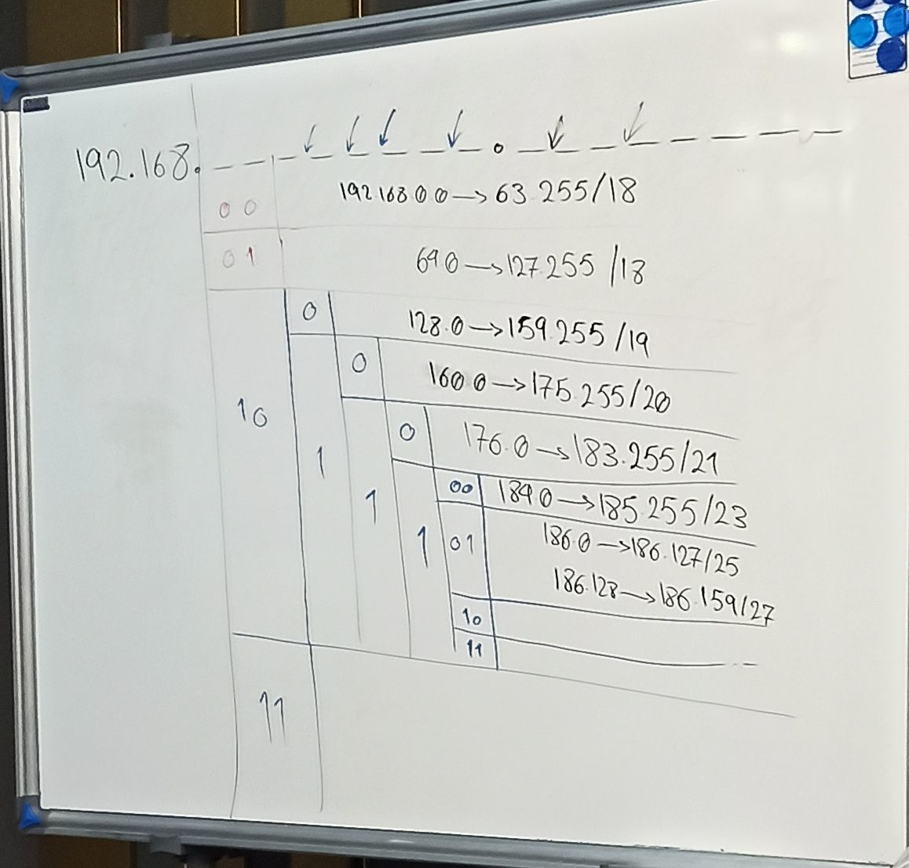

- APIPA -> 169.254.x.x
(No DHCP or ip conflict)

- LOOPBACK:
	- 
پکت ها به send buffer کارت شبکه می رود و سپس به recv buffer می رود.

2^n >= زیرشبکه ها

---
- 172.17.128.0/18
- split to 8 networks:

(128 = 10 000 000)

- 172.17.128.0/21
- 172.17.136.0/21
- 172.17.144.0/21
- 172.17.152.0/21
- 172.17.160.0/21
- 172.17.168.0/21
- 172.17.176.0/21
- 172.17.184.0/21

--- 
- 192.168.200.0/22

- slpit to 16 networks:

(111000 00.00 000000)

- 192.168.200.0/26
- 192.168.200.64/26
- 192.168.200.128/26
- 192.168.200.192/26
- 192.168.201.0/26
- ...
- 192.168.202.0/26
- ...
- 192.168.203.0/26
- ...

---

