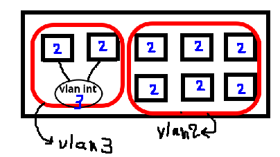
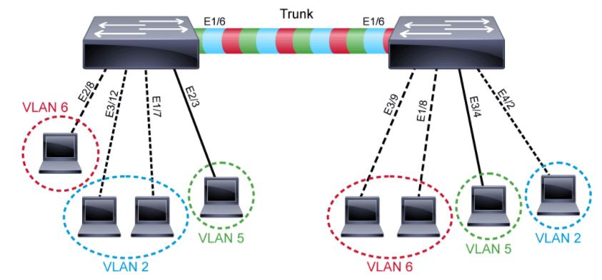
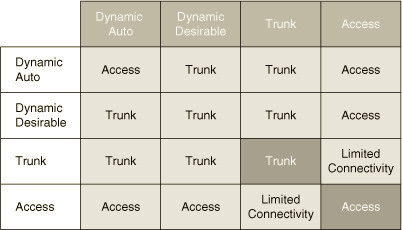
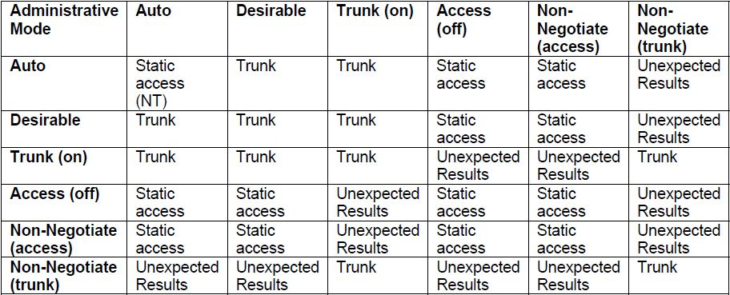

# 
- دستور تست کابل??
- اگر speed  و duplex را دستی تنظیم کنیم ، آنگاه  auto mdix غیرفعال می شود.
- اگر auto mdix خاموش باشد و port قطع شود آنگاه یعنی کابل استریت بین دو سوییچ متصل بوده است ?
- error recovery command?
- sticky -> مک آدرس به صورت ثابت ثبت می شود و بستگی به اولین پکت یا پکت هایی دارد که وارد سوییچ می شوند.(بستگی به عدد ماکسیمم ست شده برای تعداد مک آدرس ها دارد)
- سوییچ arp ساپورت میکند
-  وقتی به کامپیوتر ها در پکت تریسرip می دهیم ، پکتی را در شبکه ارسال می کنند.
-  سوییچ های multilayer روتینگ نیز میفهمند


# vlan
## intro
- در مواقع زیادی که نیاز به شبکه های کوچک زیادی هست اگر قرار باشد برای هر شبکه ی کوچک یک سوییچ بخریم مقدار زیادی باید هزینه کنیم ، در نتیجه باید سوییچ ها ما قابلیت شکسته شدن به چند سوییچ کوچکتر را داشته باشند.
- شکستن پورت های سوییچ به گروه هایی برای ایجاد سوییچ های کوچکتر
- دلایل شکستن شبکه های بزرگ به کوچک و استفاده از روتر بین آنها:
	- امنیت
	- کمتر کردن لود شبکه در نتیجه پکت های broadcast 
- شکستن لایه ۲ == رنج آی پی های متفاوت  (broadcast area)
- vlan -> جداسازی تفکیک ترافیکی از لایه ۲
# commands
- (config)# 
```
	vlan 10
	name finance
	vlan 20
	name manager
	vlan 30
```
(برای جا به جا شدن در بین vlan ها و int ها نیاز به exit نیست)
- و سپس اینترفیس را به راحتی عضو یک vlan می کنیم
- `int fa 0/1`
- (config-int)#
```
	switchport mode access
	switchport access vlan 10
```

- `int range fa 0/3-10, fa 0/15`
- `default int fa 0/1`
- `sh vlan brief`
- `int vlan 10` -> (creates vlan if not exist)
---
- `sh int trunk`
- n-802.1Q -> n means negotitate , (Packet tracer bug)
---
- `sh int fa 0/5 switchport`
- what is the meaning of switchport enabled?

---

# 
- native vlan -> vlan1
-  وی لن یک بای دیفالت وجود دارد
-  <div dir="auto" align="right" style="text-align: right"> اگر چند تا سوییچ را دیفالت به هم وصل کنیم هنگی در vlan1 قرار خواهند گرفت

# 
- every vlan group can have a vlan interface that is layer3.
- به صورت کلی اینترفیس های ویلن نمی توانند به هم وصل شوند اما استثنا نیز هست.
- 
- ip alternate?

# a challenge in vlan
## intro
- اگر بخواهیم سوییچ های داری وی لن های مختلف را به هم متصل کنیم و از طرفی بخواهیم ویلن های با شماره یکسان را به هم متصل کنیم نیاز داریم تا از هر ویلن در هر سوییچ متفاوت سیمی را متصل کنیم که در این صورت با دردسر بزرگی رو به رو خواهیم شد.
- شکل؟
## solution -> trunk
- trunk (vlan encapsulation)
- 802.1q (+4byte)
- ISL (+30byte)
- <div dir="auto" align="right" style="text-align: right"> دیگر نیاز نیست پورت access را برای اتصال vlan های یکسان جدا کنیم
- 

## 
- ISL -> recapsulate ethernet frame (+30 byte) , it has its own FCS
- 802.1Q -> recalculate FCS

## 
- ترانک در کلاینت ها می تواند خطرناک باشد
- ما می توانیم هر تعدادی بخواهیم ترانک بسازیم برای کامپیوترمان
- `switchport mode trunk/access`

##
- شکل؟
- این سناریو کار می کند ولی مثل ریختن قیمه ها در ماست است.

## switchport modes
- Access/Trunk/dynamic
- dynamic:
	- auto
		- default in newer devices
		- waits for proposal(trunking request)
	- desirable
		- starter for proposal(trunking request)
- 
- 
- حالت یک طرف  access یک طرف trunk اشتباه کانفیگی خیلی بدی است.
- administrativly: چیزی که ما دستور می دهم
- operational: چیزی که انجام شده
- هیچ وقت پورت ها را روی حالت dynamic نگذارید. زیرا خطر امنیتی دارد.

- برای بردن switchport به حالت ترانک:
	- اگر پورت در حال کار کردن باشد باید trunk encapsulation را از حالت auto در بیاوریم
- trunk encapsulation:
	- auto (select ISL in negot otherwise select dot1q)
	- dot1q
	- ISL

## native vlan
- فقط 802.1q
- هر ترانک dot1q یک native vlan دارد که دیتا را بدون تگ می فرستد و دیتای بدون تگی که دریافت می کند را جزو native vlan خودش در نظر می گیرد
- اگر ۲ سوییچ را در به صورت native vlan به هم وصل کنیم ، از آنجایی که ممکن است پورت های ترانک vlan num های متفاوتی داشته باشند ، دوباره قیمه ها در ماست ها بریزند (شکل)؟

## misc
- cisco ip phone 7942
- شکل تلفن ؟
- vlan hopping attack (شکل؟)
- پیشنهادات امنیتی راجب ویلن ها :
	- 1. random vlan numbers
	- 2.?
	- 3.?
	- 4. vlan park numbers


# Quests
- در ارتباط بین سوییچ ها ، از کجا میفهمند که اشتباهی vlan ها به یکدیگر متصل شده اند و اسم پروتکلی که این موضوع را تشخیص می دهد چیست ؟  (native vlan mismatch)
- کامند تنظیم vlan برای ip phone
- 