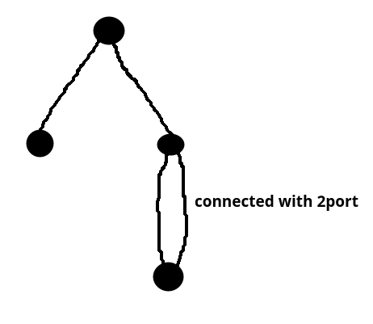

- in access ports , it is recommended to disable CDP (from security prespecitve)
- QOS:
	- layer2
	- layer3
- ip header format, dscp
- sdp , inconsistent port

# Scenario 1 (VTP)
- شکل ۱ ؟
## intro
- وقتی تعداد زیادی سوییچ و ویلن به صورت پراکنده داشته باشیم ، آنگاه کانفیگ کردن همه سوییچ ها برای داشتن آن ویلن ها کار سختی است و برای مثال اگر بخواهیم یک سوییچ جدید با ویلن های جدید اضافه کنیم بایستی این تغییرات را در دیگر سوییچ ها نیز اضافه کنیم که کار خیلی سختی خواهد بود ، درنتیجه نیاز به یک پروتکلی داریم که  کانفیگ ویلن ها را برای ما بین سوییچ ها ساده کند
- VTP -> vlan trunking protocol

## VTP
- is for trunk ports
- 
	- domain
		- switchs with same domain can sync together
	- password
	- mode
		- server (default)
		- client
		- transparent
	- version
		- 1~3
	- revision number
		- counts every change in vlan database structure
		- bigger revision number, more priority for overwriting others vlan db.

## 
- اگر همه سوییچ ها متصل باشند و vtp domain شان null باشد، در صورت ست کردن یک از vtp  domain ها ، بقیه نیز به همان اسم تغییر می کنند (vtp domain propagation)
- سینک شدن vtp مرج ندارد و باید مواظب بود
- پکت تریسر خیلی خوب vtp را ساپورت نمی کند و کمی باگ دارد 
- 
## vtp update triggers
1. timer
2. turning a trunk interface up
3. a change in vlan db

## server/client/transparant
- vtp server
	1. recives changes and apply it on itself
	2. tell others too
- vtp client
	- like vtp server but can't change anything in vlan db
- یا استفاده از previlage level و تنظیم vtp client می توانیم سوییچ را برای دیگران athorize شده تنظیم کینم
- اگر بدون ساخت vlan در حالت کلاینت ،دستور عضویت اینترفیس در ویلن را بزنیم ، اروری نخواهد داد، اما اگر در کانفیگ نگاه کنیم میبینیم که واقعا اینترفیس ما عضو آن ویلن شده ولی چون در حالت کلاینت است کار نخواهد کرد و در sh vlan brief نشان نخواهد داد
- transparent mode:
	1. recives changes but does not apply them on itself
	2. tell others the changes
	3. also does not tell anybody about its changes

	- کاربرد ها:
		- جداسازی vlan db یک سوییچ در وسط شبکه به دلایل سیاست گذاری های خاص و مسائل امنیتی بدون قطع ارتباط بقیه شبکه vtp
## Reseting the revision number
- safe approaches:
	1. change domain name
	2. switch to transparent mode
- vlan database is stored in `vlan.dat` and we can delete it for example
	- `sh flash`

## dtp
- dtp -> data trunking protocol
- DOMAINMISMATCH
- trunk negotitation ,vtp domain negotitiation

## misc
- `# sh vtp password`
	- md5 digest -> database hash with password (important for debugging)

## vtp v2
- in transparent mode does not need password

## vtp v3
- primary server, secondary server

# STP
- Spanning-tree protocol
- درخت پوشا (کمینه)
-  MST

## spec
- Bridge.id
	- |16 bit|48 bit|=64 bit|
	- |------|------|---|
	- |priority (default at start=32768)|MAC Addr (MAC of Default VLAN interface(somehow MAC addr of switch))|=Bridge.ID|

- BPDU (bridge protocol data unit)
	- every 2s these packets sent from active STP ports
	- payload:
		- senders B.id
		- root B.id
		- cost to root
		- STP Timers
- گام های انتخاباتی STP:
	1. selecting root switch
		- روت سوییچ کسی است که کمترین B.id را دارد.
		- در لحظه t=0 که هنوز کسی هیچ کس را نمی شناسد، سوییچ ها شروع به ارسال STP با این فرض که خودشان روت سوییچ هستند می کنند ولی در ادامه کسی که B.id کوچک تری دارد را به عنوان روت سوییچ می پذیرند
		- inferior and superior BPDU
		- روت سوییچ کسی است که تمام پورت هایش را باید در حالت forward قرار داد
		- از آنجایی که مک آدرس سوییچ های قدیمی تر معمولا کوچک تر است در نتیجه معمولا سوییچ های قدیمی تر روت سوییچ شبکه می شوند که این خیلی مد نظر ما نیست و قابل تغییر است
	2. selecting root port for non-root switchs
		-  root port : پورتی که کمترین کاست را تا روت دارد
		-  cost -> عددی بر اساس سرعت لینک
	3.  مشخص کردن پورت های  block  , dsignatied
		- اگر لوپ تشخیص داده شود ، پورتی که cost to root کوچکتری دارد up می کند و پورت دیگر بلاک
		- این  قسمت ها را در کتاب سیسکو با شکل نشان داده است
- بعد از پایان یافتن کار stp ، فقط timer مبروط به روت مهم خواهد بود
- برنده در جدال انتخاباتی STP:
	1. lower root b.id
	2. lower cost to root
	3. lower senders b.id
	4. lower senders port priority
		- 

- non-root switchs never send STP to root
- در نتیجه در مواردی به سمت روت دیگر انتخابات برگذار نمی شود
- در نتیجه فقط STP را دریافت می کنند

# cmds
``` 
# sh vtp status
``` 

```
(config)# vtp domain <word>

```

```
# vlan database 				(deprecated)

```

```
(config)# no vlan 10-100
```

```
# sh vtp password
```
 
```
(config)# spanning-tree vlan 1
(config)# spanning-tree priority  		(for changing root)
(config)# spanning-tree root					(macro, find root and make us suprior, primary: 24576,secondary: 28672)


														
```
# Quests
- VTP ver3 differences
- how to set null domain name for vtp
- تنظیم پسورد vtp3 و تغییرات بهبود یافته شده نسبت به ورژن های قبلی
- با استناد به چه قانونی پکت هایی که دچار loop می شوند ، discard/drop می شوند؟
	- loop prevention in switching

# extra
- scott boris Audio book