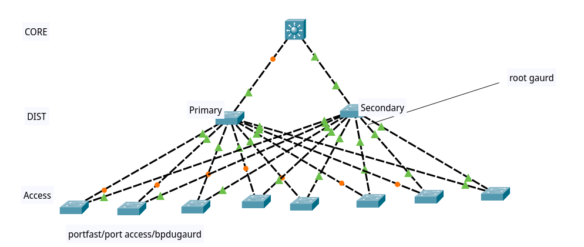

- private lan:
	- برای اختیار دادن یک زیرساخت به دیگران ، استفاده در هاستینگ ها ، کاربرد های خاص و بیشتر در سمت سرور ها
- 
 /30 -> کوچکترین ساختار شبکه ، یکی آی پی خودمان و یکی  gateway 

- Excellent (Extended) range vlan?
- 
 پارامتر کنترل loop در لایه ۳ : ttl 

- STP , RTSP -> standard protocoles
- STP+ -> cisco propriatery , backward compatibale
- PVST -> per vlan STP
- :
	- MST
	- CCT (old STP)
	- PVST
	- PVST+

# cmds
- `sh span vlan 10`
- (config)#`spanning-tree port-fast 					(bypass LRN/LSN (30s))`
- (config)#`span portfast default						(enable portfast for All ports)`
- (config)#`span mode pvst/r-pvst`
- (config)#`spanning-tree vlan 1 port-priority `
- (config)#`spanning-tree vlan 1 bpdugaurd 					(secure-down the port if BPDU recived)`
- (config)#`spanning-tree vlan 1 gaurd root/loop		(secure-down the port if we recieved superior BPDU) `

# PVST -> per vlan STP

- 
 در بررسی STP حتما باید vlan ها را در نظر گرفت

- --
- 
در استاندارد سیسکو ، شماره priority با شماره vlan جمع می شود تا بین vlan ها priority متفاوت باشد
- 
دقیقا علت فاصله ی بین اعداد priority به این دلیل ضریب 4096 است که با اعداد vlan تداخل پیدا نکند

# Role of port
- Root/Designated/Alternate:
- سوویچ روت پورت ندارد
- Designated:
	- 
قرار است up شوند و در حالت Forward قرار بگیرند
- Alterante:
	- 
قرار نیست up شوند و باید در حالت block قرار بگیرند

- States:

||Recieve BPDU|Send BPDU|CAM register|Packet Forward|
|--|--|--|--|--|
|block|✅️|❌️|❌️|❌️|
|Listening|✅️|✅️|❌️|❌️|
|Learning|✅️|✅️|✅️|❌️|
|Forward|✅️|✅️|✅️|✅️|

BLK -> LSN(15s) -> LRN(15s) -> FWD

- 
در RSTP فاز LSN و LRN را یکی کرده اند 
- Forward delay
- 
 این به این درد می خورد که به ما اجازه اطمینان می دهد که از loop جلوگیری کنیم ،  در ابتدا جلوی ایجاد loop را می گیرد.
- BLK -> Altn
- LSN,LRN,FWD -> Desg

# portfast
- `spanning-tree port-fast 			(bypass LRN/LSN (30s))`

در این حالت هنوز STP کار می کند ، مثلا اگر سوییچ ما از این پورت BPDU مربوط به خودش را دریافت کند پورت را می بندد
(BLK),(inconsistent port)

- 
 باید سعی کنیم در سمت edge ها یا endpoint ها portfast را فعال کنیم . چرا؟

- TCN -> Topology change notification
- 
 وقتی یک پورت قطع و وصل می شود ، سوییچ نگران می شود و به root ، یک پکت TCN (خبر بد) می فرستد ، و سپس بار دیگر root می آید و به کل شبکه ‌BPDU می فرستد و به خاطر اینکه فکر می کند که ممکن است توپولوژی نغییر کرده باشد به همه هشدار می دهد ، و سعی می کند aging time مربوط به cam table را کم کنند تا اگر کسی بود زودتر بیرون بیوفتد.

- Portfast -> does not genrate TCN
- 
 پورت فست برای RPVST خیلی خوب است چرا؟
- 
 پورت فست BPDU را ignore می کند؟
# misc , STP
- STP Hello time -> 2s
	- برای روت ارزش دارد که تغییر بدهیم
- STP max age -> 20s
	- 
 اگر ۲۰ثانیه طول بکشد و BPDU دریافت نشود ، TCN می زند و دنبال مسیر دیگری میگردد (خبر بد)
- shr(share) -> half-duplex , 10mbps , ...?
- p2p -> full duplex ,100mbps

- 
 اس تی پی در access port ، فقط برای vlan مربوط به همان پورت است ولی در trunk port برای همه vlan  ها است
- 
 یکی کردن ۲ پورت در etherchannel
- hpe msa 2060 enclousure

# switching block
- 
 ترافیک ریموت vs ترافیک local?
- intro?

- Switching block (MST: multilayer spanning tree)

- 
 در یک switching block به این شکل مشکلی که داریم این است که STP معمولی باعث میشود خیلی نتوانیم از دیزاین شبکه خود به خوبی استفاده کنیم پس باید تغییراتی در کانفیگ STP خود بدهیم
- 
 در بین سوییچ های لایه DIST می توانیم حتی از etherchannel استفاده کنیم تا سرعت را بین آنیا ببریم بالا
- 
 برای لایه Dis کسی 2960 نمی گذارد چرا؟

# Stack module
- 2960x stack module -> convert multiple switchs into the one
- 3750 power stack
- برای کامل کردن قدرت پردازشی لوپ را تشکیل دهید
- انتخاب سوییچ مستر در استک ، یک سری گام های انتخاباتی دارد

# etherchannel
- دیگر از تولید لوپ  در مواردی جلوگیری می شود
- 

# TCN
- 
 دو مدل TCN داریم:
	- direct
		- بلافاطله می فهمد و منتظر نمی ماند
	- indirect
		- 
 بلافاصله نمی فهمد و باید منتظر بماند تا مشخص شود در نتیجه نیاز به timeout ها زیاد است
		- 
 در بدترین حالت ممکن است ۵۲ ثانیه طول بکشد و نفهمد که قطعی رخ داده است:

|Hello Time|Forward Delay|Max Age|total|
|--|--|--|--|
|20s|30s|2s|52s|

- 
 روش نمایش indirect:

- 

# Extra
- PXE boot

# Quests
- 
 فرق role و sts در پروتکل های PVST و R-PVST 
- 
 مدل لبه
	- port type (edge ?) in rtsp
- 
 قانون sync در RPVST چه می کند
- 
 در مورد sync بیشتر بخوانید
- how to disable STP?