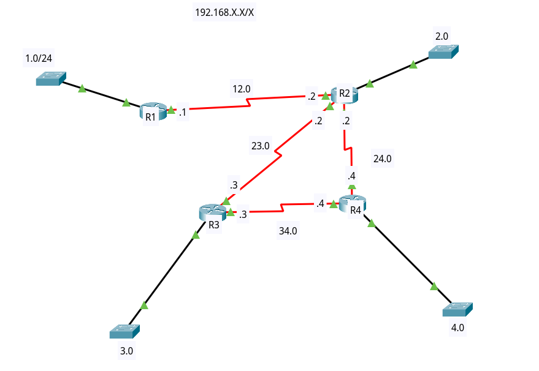
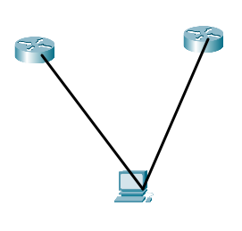

- icmp
	- layer 3 protocol

# etherchannel
- NIC teaming, port aggregation, port group, ehterchannle
- Access/trunk 
	- هر دو نوع پورت قابل etherchannel شدن هستند
- 
 نوع دو پورت که قرار است etherchannel شوند باید یکی باشد
- ذاتشان هم باید یک باشد
	- access/duplex/any other config...
- مراحل:
	-  `# default int range fa 0/1-2 (important)`
	-  انجام کار های دیگر مثل ترانک کردن
	- `# channel-group 1 mode lacp/pagp`
		- پروتکل مذاکراتی برای اترچنل(بهتر است در شرابط مختلف؟)
		- pagp: cisco propriatery
		- lacp
		- auto/passive یا desirable/active مثل dynamic در trunk
		- شماره etherchannel یک چیز لوکال در خود سوییچ ما است و چیز مهمی نیست و نیاز نیست در ۲ طرف یکی باشد
	- `sh etherchannel summery`
	- `sh span ...`
	- `int port-channel`
- 
 از روی قیافه نمی توان لوپ را در گراف شبکه تشخیص داد زیرا ممکن است pvst یا etherchannel باشد
- 
 الگوریتم های load balance در ehterchannel
- `port-channel load-balance ?`
	- روش های dst-ip یا src-ip  خیلی روش های خوبی نیستند زیرا اگر برای مثال شبکه یک sender قوی داشته باشیم که در شبکه به صورت تکراری به یک جای تکراری دیتا میفرستد خیلی تغییری در load balancing بار شبکه نمی کند
	- از همه بهتر src-dst است که اگر سوییچ ما پورت را هم ساپورت کند که دیگه از همه بهتر است
	- سوییچ های سری بالاتر مثل 4000 پورت نیز ساپورت می کنند

# Routing
- کلماتی که باید آشنا باشیم:
	- router
		- تجهیز سخت افزاری یا نرم افزاری که قرار است مسیریابی را برای ما انجام دهد
	- routing
		- کاری که router می کند
	- route
		- مسیر ها یا اطلاعاتی که روتر ها قرار است بر اساس آنها مسیریابی را نجام دهند
	- routing table 
		- جدولی که در آن route ها ذخیره می شوند
	- routing protocols
		- قرار است یک کار قاعده مند را انجام دهند
- دو نوع route داریم:
	- static -> از پروتکل استفاده نمی کند
		- مزایا:
			- lower (not very significant) overhead process
			- more configurable
	- dynamic -> پروتکل ها مسیر ها را پیدا می کنند
		- مزایا: 
			- easy config, auto recovery
	- نمی توان گفت در کجا باید استاتیک و در کجا باید از داینامیک استفاده کرد ، این بستگی به ما و شرایط دارد
- dynamic :
	- IGP -> تحت مدیریت یکپارچه راه اندازی می شوند
	- EGP -> BGP(IBGP/EBGP)
- الزامی نیست که در جایی حتما IGP یا EGP راه اندازی شود ، شدنی هست که در جاهای مختلف هر کدام استفاده شود ولی خودمان اذیت می شویم
- IGP:
	- D.V
		- با هم روتینگ تیبل مبادله می کنند
	- Link state
		- با هم topology data مبادله می کنند
	- hybrid (usually not mentioned)
- Distance vector -> RIP,IGRP
- Link state -> OSPF,IS-IS
- Hybrid -> EIGRP(cisco) (but is D.V by nature)(it is a good protocol)

- پروتکل های pass-vector :
	- BGP
		- بر اساس as-path مسیر ها را بدست می آورد
	
	
# metric
- هر مسیر یک هزینه دارد (metric)
- ساده ترین متریک همان hop count است

#

- در این جا ما ۸ شبکه مختلف داریم 
- برای مثال R1 به ۲ شبکه متصل است ولی ۶ تا را نمی شناسد درنتیجه ما باید ۶ تا route به آن آموزش بدهیم
- route:
	- برای رسیدن به چه شبکه ای (آدرس شبکه) ، با چه سابنت ای ، بسته را از کدام nt به چه روتری (آی پی اش) ، تحویل دهیم
	- پاسخ به این سوالات جدول روتینگ ما است
- routing table example:

|Network|Subnet mask|Interface|Next hop Gateway|Metric|
|--|--|--|--|--|
|192.168.4.0|/24|se 1/0|192.168.12.2|2|

- Administrative distance 
	- هر routing protocol ، یک A.D خودش را دارد
	- هر کس که عدد کوچکتری داشته  باشد ، اولویت بالاتری دارد
	- این عدد را می توان تغییر داد
	- wikipedia
- 
 در سیسکو ، برای route های استاتیک از شما در انتها metric نمیپرسد بلکه distance  را می پرسد
- انتخابات routing table:
	1. match
	2. longest prefix matching
	3. metric
	4. select all if all matchs (load balancing)
- 
 پروتکل ها هر کدام مستقل کار می کنند ، در انتها جدول رویتنگ تصمیم می گیرد که حرف کدام را برای یک  نتورک انتخاب کند ، بر اساس A.D
- per packet load balancing 
	- در سیسکو نداریم چون بار پردازشی زیادی دارد
- load balancing in cisco (routing table)(algorithm , فعال/غیرفعال)
- 
 هیچ وقت برای یک کامپیوتر ۲ تا gw اضافه نکنید ، زیرا کار نخواهد کرد مگر اینکه متریک یا load balancing داشته باشد. راه بهتر یک gw یا specific static route برای gw دیگر است
