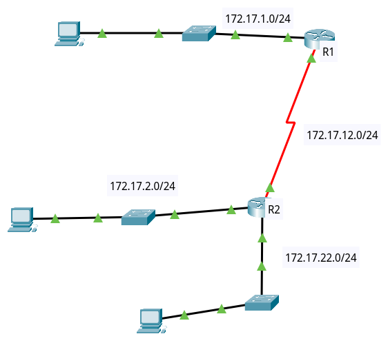
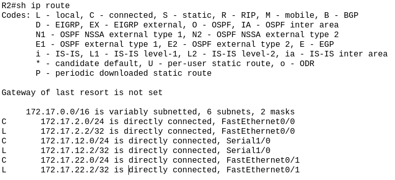
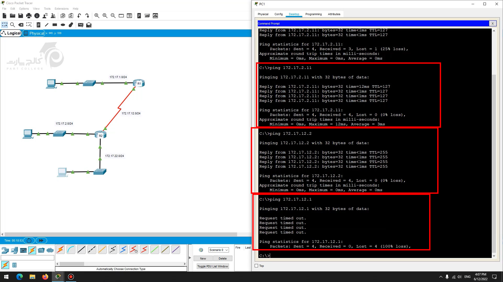
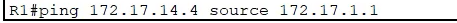
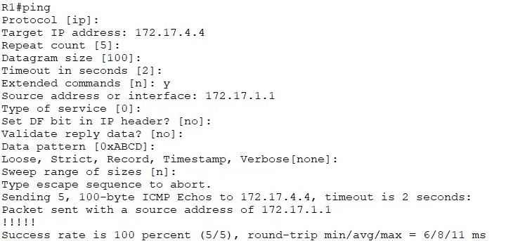

# cmds
- `show ip route`

# 

- دو کامپیوتر پایین همدیگر را می توانند پینگ بگیرند اگر gateway برای آنها ست شده باشد، زیرا در جدول روتنیگ R2 ، روت های مورد نیاز وجود دارد

 در هنگام پینگ گرفتن ،وقتی پکت icmp به gateway می رسد، روتر از آنجایی که قرار است به یکی از شبکه های local خود پکت را ارسال کند در نتیجه مک گیرنده را arp می کند.

-برای شبکه های directly connected هیچ کاری نیاز نیست بکنیم و روت بنویسیم

- 

- وقتی آیپی 172.17.12.1 را روتر R2 پینگ می گیرد ،آیا نیاز دارد که بوسیله arp مک آدرس R1 را بدست بیاورد؟
	- نه زیرا ارتباط بین دو روتر از نوع serial است و پروتکل لایه ۲ آنها از نوع p2p می باشد (hdlc)
- route summerization
- این متریک است:

و کنار آن عدد 2 درواقع A.D است ، وقتی static route می نویسیم می توانیم A.D را فقط مشخص کنیم.

- روش پینگ کردن از روتر با عوض کردن source ip پکت ها:

- اگر در هنگام پینگ کردن در روتر ، source ip مشخص نکنیم آنگاه خودش source ip را آی پی اینترفیسی که قرار است از آن پکت ها خارج شوند می گذارد

# dynamic routing protocols
-

# TODO: RIP

# quests
- فرق next hop route و interface route چیست؟
- سناریو را در پکت تریسر ویندوز ارسال کنید