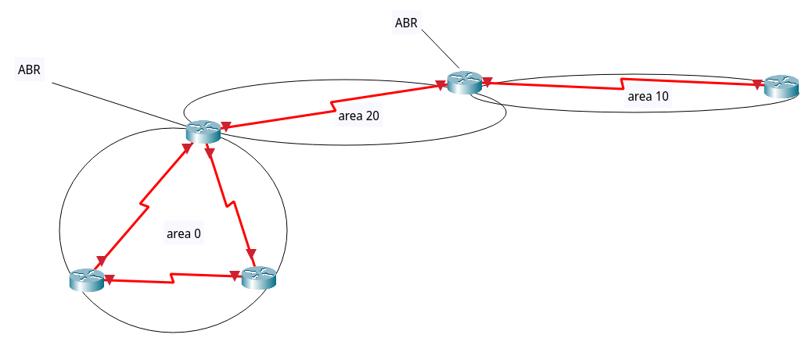

# OSPF => Open shortest path first
- A.D = 110
- از قوانین همسایگی پیروی می کند
- برای همسایه شدن Hello می فرستد مثل EIGRP
- پکت های Hello را multicast می کند مثل EIGRP
	- 224.0.0.5
	- 224.0.0.6
- از ساختار های area بندی استفاده می کند که با Autonomous System در EIGRP فرق دارد 
- VLSM را کامل ساپورت میکند ؟
- محاسبه metric => فقط bandwitdh
- inceremental update, trigger update
- مدل area در OSPF با AS در EIGRP هیچ شباهتی به هم ندارند
- در شبکه های با چند area حتما باید area 0 را داشته باشیم ولی در شبکه های تک area الزامی نیست
- OSPF در شرایط همسایگی کمی پیچیده تر عمل می کند
- برای مثال:

روت های مربوط به area 10 در area 0 ریخته نمی شوند زیرا ABR ما به area 0 وصل نیست ، مگر اینکه virtual link بزنیم

# scenario 1
- TODO