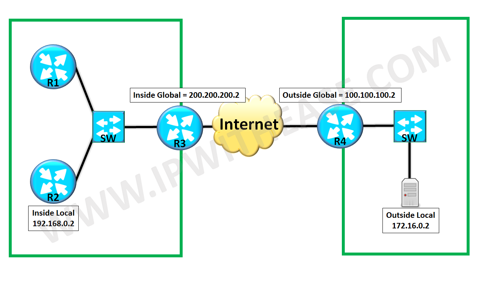

# Nat


---
- static nat:

```
(config-if)# ip nat inside
(config-if)# ip nat outside
(config)# ip nat inside source static 172.17.22.11 172.17.12.2
```


- dynamic nat:
```
(config-if)# ip nat inside
(config-if)# ip nat outside

(config)# ip access-list standard NAT0
(config-std-nacl)# permit 172.17.2.0 0.0.0.255 
(config-std-nacl)# deny host 172.17.22.11
(config-std-nacl)# permit 172.17.22.0 0.0.0.255 
(config-std-nacl)# do sh ip access
(config-std-nacl)# exit

(config)# ip nat pool TEST 172.17.12.2 172.17.12.10 netmask 255.255.255.0

(config)# ip nat inside source list NAT0 pool TEST
```

- dynamic with port overloading:
	- `(config)# ip nat inside source list NAT0 pool TEST` **overload**
	- `(config)# ip nat inside source list NAT0 interface se 1/0` **overload**

---
```
sh ip nat translations
clear ip nat translations *
```


# ipv6
- 128bit = 8Hextet
- example: `fe80:0000:0000:0000:bb54:db1f:f2d0:fbbd/64`
- example: `::1/128					(loopback)`		
- example: `::/0					(default route)`
- دو قانون خلاصه نویسی ipv6
- 