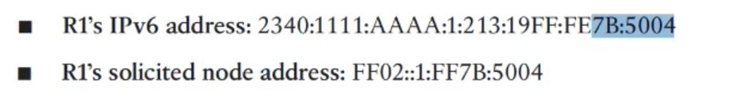

# RS/RA
- router solicitation 
- router advertisement


- ipv6 common addresses


- link-local address

	

	


- solicticated address
	+ **FF02::1:FF**00:0/104

	

	+ used for NDP (ARP functionality in ipv6)
	
	
- DAD (duplicate address detection)
	
	


---

- `(config)# ipv6 unicast-routing`

- `# sh ipv int fa 0/0`


- برای گرفتن ipv6 به صورت autoconfig بایستی حتما یک router در شبکه موجود باشد که پراسس روتینگ ipv6 برایش فعال باشد 
- کامپیوتر بعد از به درست آوردن ipv6 به صورت autoconfig ، روت دیفالتی به آی پی link-local روتر gateway می نویسد.


# ipv6 RIP

```
(config)# ipv6 router rip R1
(config-rtr)# exit

(config)# int se 1/0
(config-if)# ipv6 rip R1 enable
```

- نکته: اگر static route نوشته باشیم ، دیگر آن route به بقیه advertise نمی شود


# ipv6 ospf
```
(config)# ipv6 router ospf <pid>
(config-rtr)# router-id 2.2.2.2
(config-rtr)# exit

(config)# int se 1/0
(config-if)# ipv6 ospf 1 area 0
```

- چرا در روتینگ تیبل آی پی next-hop ، آی پی link-local استفاده می شود؟ 
	+ چون این آی پی تغییر نمی کند حتی اگر آی پی اینترفیس را دستی عوض کنیم
	

# ipv6 eigrp
```
(config)# ipv6 router eigrp <AS num>
(config-rtr)# eigrp router-id 2.2.2.2
(config-rtr)# exit

(config)# int se 1/0
(config-if)# ipv6 eigrp 1
```


# Wan

- e1
	+ (32-2) line
	+ 64kbit per line
	
- t1
	+ 24 line

- line terminal
	+ 16 * e1
	
- sdm1 module
	+ 64 * e1
	
	

	
- `interface serial 0/0`**:1**
	+ **:1** is channel group