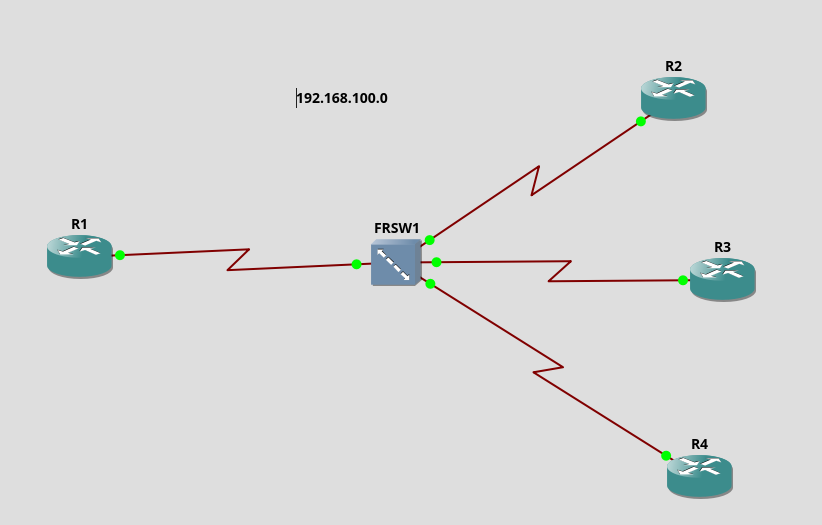

# Frame Relay
- 

- 

- LMI (Local Management Interface) protocol: for automatic receive of Frame-Relay map 
	+ how it works? using inverse ARP
		* Once the interface is brought up with the no shutdown command, the Frame Relay switch will use Local Management Interface (LMI) to communicate the Data-Link Connection Identifier (DLCI) information to the router. Once the DLCIs have attained an active state, meaning that both sides of the connection are up and the Frame Relay switch has the correct Frame Relay route statements, Inverse Address Resolution Protocol (ARP) is performed to map the remote Layer 3 addresses to local DLCIs. Inverse ARP entries are noted in the Frame Relay address mapping table with the keyword dynamic. You can view this table by entering the show frame-relay map command.
		* Inverse ARP works very well in a full mesh Frame Relay topology. However, Inverse ARP has many shortcomings. Inverse ARP will not provide a complete mapping solution in a partial mesh (hub and spoke) topology. Also, Inverse ARP will resolve the Internet Protocol (IP) address of the next-hop router's physical interface even if this IP address is not part of the same IP subnet. This can cause problems in the CCIE Lab and in the real world.

		* It is recommended that Inverse ARP be disabled on all of your Frame Relay routers in the CCIE Lab. It is also recommended that you disable Inverse ARP before actually bringing up your Frame Relay interfaces with the no shutdown command. If Inverse ARP is not disabled before bringing up the interface, you will have to manually clear the Inverse ARP mappings using the clear frame-relay-inarp command once your static mappings are in place. Some versions of the Internetwork Operating System (IOS) will actually require a reload to clear the Inverse ARP entries out of the Frame Relay address mapping table, even after entering this command.
		* [source](https://www.ccexpert.us/ccie-2/inverse-arp-should-be-disabled-before-bringing-up-the-frame-relay-interface.html)
	+ how to disable it?
	

- cmds:
```
do sh fram map				(check for DLCI maps)
fram map ip 192.168.100.3 201
```


- در این سناریو آي پی خودشان را نمی توانند پینگ کنند مگر اینکه برای خودشان map بنویسند

# EIGRP in Frame-Relay
- اگر برای سناریوی بالا eigrp را برای همه روتر ها روشن کنیم به این شکل:

	+ R1:
		* `router eigrp 1`
		* `net 192.168.100.0`
		* `net 1.1.1.1 0.0.0.0`
	+ R2:
		* `router eigrp 1`
		* `net 192.168.100.0`
		* `net 2.2.2.2 0.0.0.0`
	+ R3:
		* `router eigrp 1`
		* `net 192.168.100.0`
		* `net 3.3.3.3 0.0.0.0`
	+ R4:
		* `router eigrp 1`
		* `net 192.168.100.0`
		* `net 4.4.4.4 0.0.0.0`

- سپس همگی با R1 همسایه می شوند اما مشکل اصلی اینجاست که از آنجایی که eigrp یک پروتکل distance vector است ، طبق قاعده split horizon روتر R1 اجازه نمی دهد که route های دریافت شده از روتر مثلا R2 را R3 نیز دریافت کند.
	+ قاعده split horizon:
		* روتی که از اینترفیس X آموختی ،روی اینترفیس X تبلیغ نکن.

- در نتیجه بایستی split horizon را در R1 خاموش کرد:
	+ `int se 1/0`
	+ `no ip split-horizon eigrp 1`
	دریافت شده از روتر مثلا R2 را R3 نیز 
- `no ip split-horizon` 
	+ اگر این را خالی بزنیم برای RIP است