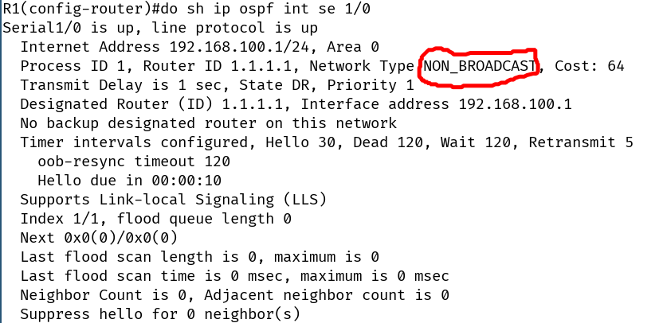

# scenario 1

- 
 ابتدا ospf را برای همه روتر ها اجرا می کنیم:

	+ R1:
		* `router ospf 1`
		* `net 192.168.100.0 0.0.0.255 area 0`
		* `net 1.1.1.1 0.0.0.0 area 0`
	+ R2:
		* `router ospf 2`
		* `net 192.168.100.0 0.0.0.255 area 0`
		* `net 2.2.2.2 0.0.0.0 area 0`
	+ R3:
		* `router ospf 3`
		* `net 192.168.100.0 0.0.0.255 area 0`
		* `net 3.3.3.3 0.0.0.0 area 0`
	+ R4:
		* `router ospf 4`
		* `net 192.168.100.0 0.0.0.255 area 0`
		* `net 4.4.4.4 0.0.0.0 area 0`
---
- اولین مشکل : هیچکدام از روتر ها با یکدیگر همسایه نمی شوند
	+ علت: چون hello هایشون به یکدیگر نمی رسد
	+ ابتدا باید چه چیزهایی را چک کنیم؟
		* `sh ip ospf neighbor`
		* `sh ip protocols`
		* `debug ospf hello`
		* `debug ospf adj`
		* `debug ospf packet`
		* `sh ip ospf int se 1/0`
	+ علت دقیق تر: چون این سناریو شبکه NON_BROADCAST می باشد و در این نوع شبکه ها ما مولتی کست و برادکست نداریم ، و pseudo-broadcast داریم، درنتیجه OSPF هیچ گونه فعالیتی در این شبکه نخواهد کرد

	+ اسم این شبکه ها به اصطلاح NBMA می باشد مخفف Non-Broadcast Multiple Access ، یعنی شبکه ی ما برادکست ساپورت نمی کند ولی multiple access است
	
	- OSPF interface network types:

	

	

	- راه حل اول: دستی ست کردن neighbor ها در OSPF
		+ اگر این کار را بکنیم باید تمامی neighbor ها را در تمامی روترها دستی ست کنیم

	
	- راه حل دوم: تغییر network type به BROADCAST
		+ `(config-if)# ip ospf network broadcast`
		
- دومین مشکل: اگر DR از روتر های ۲ و ۳ و ۴ انتخاب شود آنگاه route ها به صورت کامل در همه روتر ها ایجاد نخواهد شد زیرا DR نمی تواند به درستی همه route ها را دریافت و پخش کند. در نتیجه DR بایستی حتما در hub شبکه باشد.
	+ راه حل۱: DR را R1 کنیم ، اما چگونه؟ با تغییر priority در بقیه روتر ها به صفر، ولی اگر priority را در R1 بالا ببریم این روش پایداری نیست زیرا اگر R1 دیرتر روشن شود باز هم DR نمی شود
		* `(config-if)# ip ospf priority 0`
	+ راه حل۲: شبکه را full mesh کنیم
	

# Scenario2: NBMA (more than 1 subnet)

- در این سناریو R1 دو sub-interface یکی از نوع point-to-point و دیگری از نوع multi-point بایستی بسازد
	+ `int se 1/0`
	+ `encap frame-relay`
	+ `no shut`
	+ `exit`
	+ `int se 1/0.12`
	+ `int se 1/0.134`

- پس از ست کردن آی پی ها سر اینترفیس ها خواهیم دید که DCLI map ها را روتر ها ندارند. درنتیجه نمی توانند همدیگر را پینگ کنند.
	+ tshot:
		* `sh ip int br`
		* `sh frame map`
		
	- خواهیم دید که هیچ DLCI ای دریافت نشده.مشکل چیست؟ در سناریو های قبل تر روتر ها ابتدا با استفاده از پروتکل LMI از سوییچ مخابراتی DLCI ها را دریافت می کردند و سپس با استفاده از inverse arp آی پی های یکدیگر را بدست می آورند. در این سناریو نیز LMI مشکلی ندارد و R1 تمامی DLCI ها را دریافت می کند ولی نمی داند بایستی روی کدام ساب اینترفیس خودش آن را ست کند
		+ راه حل: بایستی frame-relay map ها را دستی وارد کنیم
			1. `(config-subif)# frame-relay map ip 192.168.12.2 102`
				- error:  Only frame-relay interface-dlci command should beused on point-to-point interfaces not frame-relay map
				- یعنی روی اینترفیس پوینت تو پوینت نیازی به ip نیست پس دستور ما باید اینگونه باشد:
				- `frame-relay interface-dlci 102`
				- بعد از این دستور R2 می تواند بوسیله inverse arp آی پی R1 را بدست آورد و در واقع از R1 جواب دریافت کند.
			2. `(config-subif)# frame-relay map ip 192.168.134.3 103`
			3. `(config-subif)# frame-relay map ip 192.168.134.4 104`
			
			4. و در انتها اگر خواستیم که R3 و R4 یکدیگر را پینگ کنند می توانند map برای خودشان اضافه کنند

# EIGRP in scenario 2
-
	+ R1:
		* `router eigrp 1`
		* `net 192.168.12.0`
		* `net 192.168.134.0`
		* `net 1.1.1.1 0.0.0.0`
	+ R2:
		* `router eigrp 1`
		* `net 192.168.12.0`
		* `net 2.2.2.2 0.0.0.0`
	+ R3:
		* `router eigrp 1`
		* `net 192.168.134.0`
		* `net 3.3.3.3 0.0.0.0`
	+ R4:
		* `router eigrp 1`
		* `net 192.168.134.0`
		* `net 4.4.4.4 0.0.0.0`
		
1. پس از تنظیم eigrp فقط روتر R1 با همه روتر ها همسایه می شود ولی R3 و R4 پیغام همسایگی نمی دهند.
	+ tshot:
		* `debug eigrp packets`
		
	+ علت: hello یک طرفه ، یعنی R1 پکت های hello را دریافت می کند ولی پکت های hello مربوط به R1 را بقیه دریافت نمی کنند
	+ علت دقیق تر: مشکل ما frame-relay map های ماست، ما در این سناریو map ها را در دستی وارد کردیم ، حال اگر map ما تگ broadcast را نداشته باشد مالتی کست نیز کار نخواهد کرد.
	
		

	+ راه حل: در نوشتن مپ ها کلمه broadcast را نیز قید کنیم:
		* `frame-relay map ip 192.168.134.3 dlci 103 broadcast`
		

2. مشکل بعد:‌ مشکل split horizon در ساب اینترفیس 134 ، اما R2 مشکلی ندارد چون ساب اینترفیس جدایی دارد

# OSPF in scenario 2
- از ادامه ماجرای بالا شروع می کنیم و فقط eigrp ها را غیرفعال می کنیم
-
	+ R1:
		* `router ospf 1`
		* `net 192.168.12.0 0.0.0.255 area 0`
		* `net 192.168.134.0 0.0.0.255 area 0`
		* `net 1.1.1.1 0.0.0.0 area 0`
	+ R2:
		* `router ospf 2`
		* `net 192.168.12.0 0.0.0.255 area 0`
		* `net 2.2.2.2 0.0.0.0 area 0`
	+ R3:
		* `router ospf 3`
		* `net 192.168.134.0 0.0.0.255 area 0`
		* `net 3.3.3.3 0.0.0.0 area 0`
	+ R4:
		* `router ospf 4`
		* `net 192.168.134.0 0.0.0.255 area 0`
		* `net 4.4.4.4 0.0.0.0 area 0`
		
- اولین مشکل : هیچ همسایگی رخ نمی دهد
	+ علت: مشکل OSPF در شبکه NON_BROADCAST ، در R1 ساب اینترفیس ۱۲ پوینت تو پوینت تشخیص داده می شود ولی در R2 این اینترفیس NON_BROADCAST است در نتیجه پاسخی از R2 به سمت R1 گرفته نمی شود.
		* راه حل: اگر در این حالت دستی neighbor تعریف کنیم باز هم همسایه نمی شوند چون hello/dead time دو طرف متفاوت است ، پس تنها راه عوض کردن network type است
		
- دومین مشکل: مشکل DR نبودن hub شبکه در ساب اینترفیس ۱۳۴
	+ این سناریو نسخه کوچک شده سناریو های قبلی است