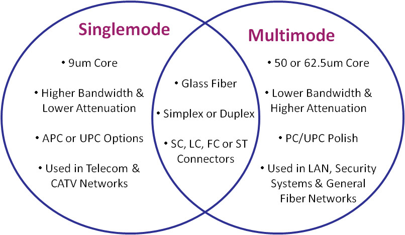
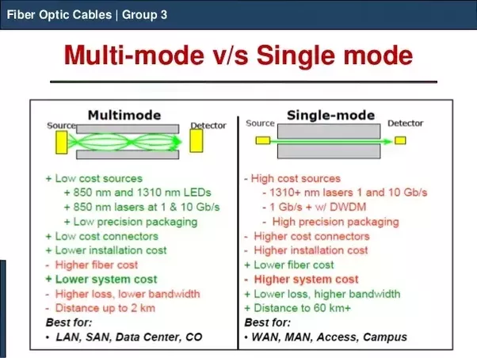
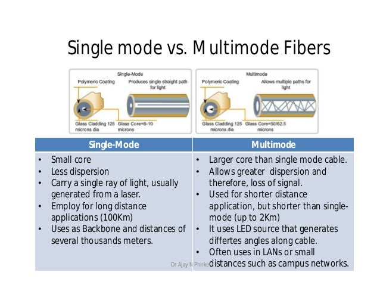

- Mikrotik RB951 (POE) (POE OUT)

- switch 2960x poe (managable poe)

- LOM=LIST OF MATERIALS NEEDED 

- patch panel poe

---
| | |
|---|---|
|pc|switch|
|ip phone|bridge|
|router| |

---

# Fiber optical cable
### multi mode(mm) vs single mode(sm)

- sfp fiber connector
-  loose buffer vs tight Buffer
- lc-lc fiber
- lc-sc fiber

# layer 1: cable, hub, NIC , Repeater
- hubs are very noob and dumb...
- hubs use shared buses
- hubs are somehow a repeater
- repeater is just a hub with 2 port ... Like switch and bridge
- hubs doesnt have a mac
- hubs are half-dup

# layer 2: mac (media access control), llc (logical link control)
- CSMA
- الگوریتم عقب گرد توانی
- **سی اس ام ای ، در شبکه های سیمی و بی سیمی متفاوت است ، این پروتوکل در شبکه های بی سیم و سیمی چه اسمی دارد و چه فرقی دارند؟**

- layer 2 standard : ethernet (802.3)
- ethernet frame
- framing is one of things llc should do
- کنترل خطای بیتی نیز یکی از وظایف ال ال سی است
- csma is task of MAC.
- point to point : یعنی فقط ما اتصال دوطرفه داریم و نه بیشتر یعنی نه مثل وایرلس
و اگر بحث سوییچینگ بیاید وسط دیگر پوینت تو پوینت نیست
- hdlc, ppp

---
- hardware address, layer 2 identifier , MAC
- switch , bridge
- پروتکل های پوینت تو پوینت نیاز به mac ندارند
- پروتوکل های پکت سوییچینگ در شبکه های مخابراتی مانند frame relay 
- mpls
- pvp , atm, 
- پروتکل های لایه ۲ خیلی زیادند که مدل فریم خودشان را دارند...
- پروتکلی که ما استفاده میکنیم بیشتر استاندارد ethernet را استفاده میکنند
- pppoe , vpi , vci ( identifier)
- از کامپیوتر ما تا آن سر دنیا بارها و بار های پروتکل لایه ۲ تغییر میکند
- what is the purpose of identifier like MAC? Switching

- دستگاه سوویچ فانکشانالیتی اش در لایه ۲ است ولی لایه های بالاتر را نیز می بیند، سوییچ سیستم عامل دارد و آی پی دارد و آی پی میفهمد و می تواند قوانینی را برای پورت و آی پی نیز بگذارد.
- سوییچ هایی داریم که لایه ۳ نیز کار میکنند که به آنها multilayer- switch می گوییم. که در واقع یک روتر درون خود دارند (یعنی چه؟)

- بریدج همان سوییچ با دو پورت است. در گذشته از هاب ها زیاد استفاده میشده که باعث خراب شدن شبکه می شود زیرا هاب ها نمی توانند شبکه ی پر سرعتی داشته باشند، پس نیاز می شد که از بریدج گاهی برای کاهش تاثیر هاب ها استفاده شود ، زیرا بریدج توانایی این را دارد که فقط پکت های مربوط به فریم های با مک آدرس مورد نظر را سوییچ کند

---
-  **پی لود پروتکل arp و اینکه چگونه کار میکند**
- **آیا dest mac addr در فریم های ما با عوض شدن شبکه عوض می شوند؟**
- **بیت هفتم و هشتم مک آدرس چه کاربردی دارند؟ یک قاعده و اصولی در آن ها وجود دارد که باید رعایت شود ، برای ipv6 استفاده می شود.**

---
# layer 3: ip (network)

# Layer 4: transport
- tcp : connection oriented , reliable
- udp : connection-less , unreliable 

- tcp: packet recovery, flow control (https://www.brianstorti.com/tcp-flow-control/)
- tcp windows size (rwnd)
- tcp congestion control (differ with tcp flow control)
-  الزاما به ازای هر پکت tcp الزاما ack ارسال نمی شود.

- فرق session و connection

---
# extra
- https://www.softether.org/4-docs/1-manual/1._SoftEther_VPN_Overview/1.4_VPN_Processing_Principle_and_Communication_Method
- https://www.softether.org/4-docs/1-manual/1._SoftEther_VPN_Overview/1.2_SoftEther_VPN_Components