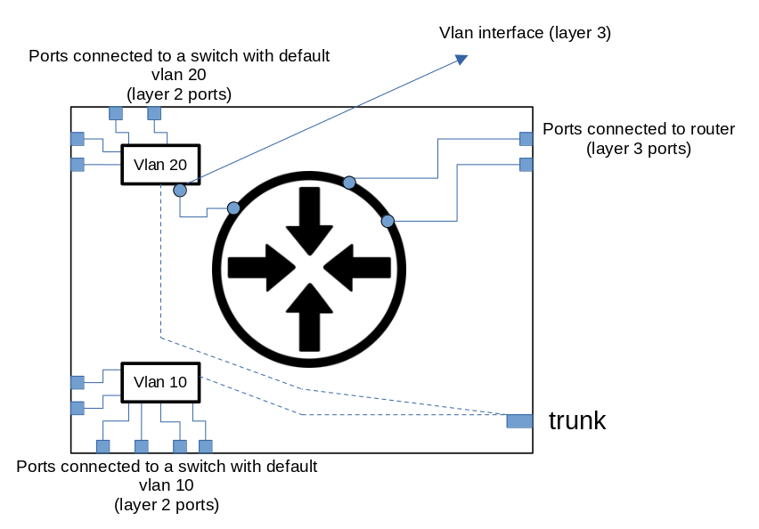
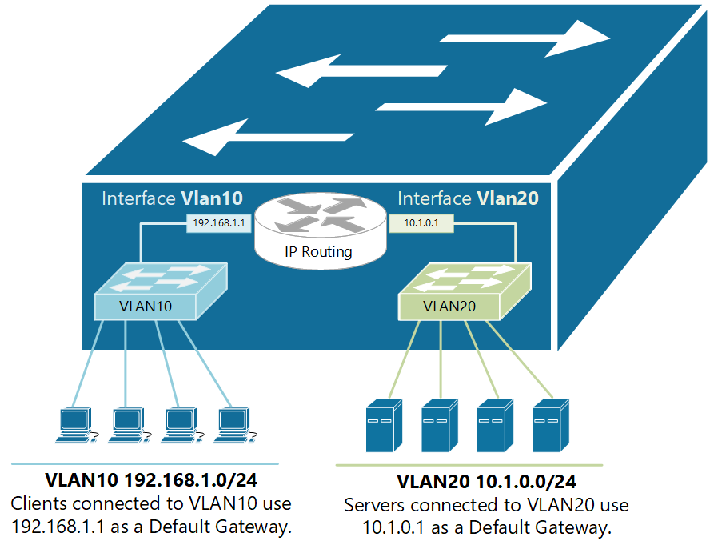
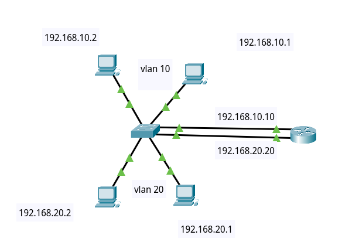
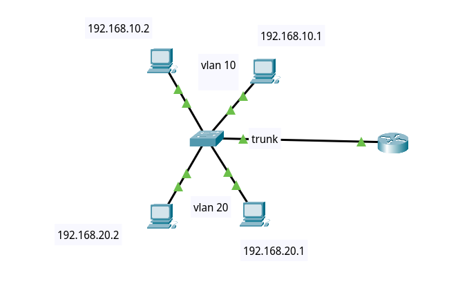
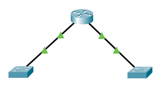
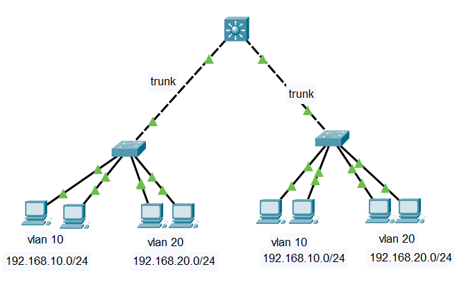
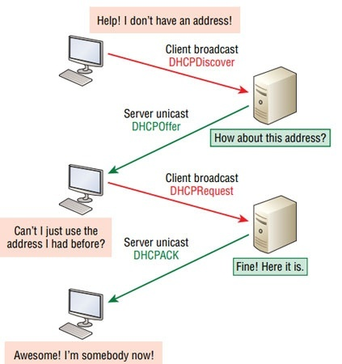
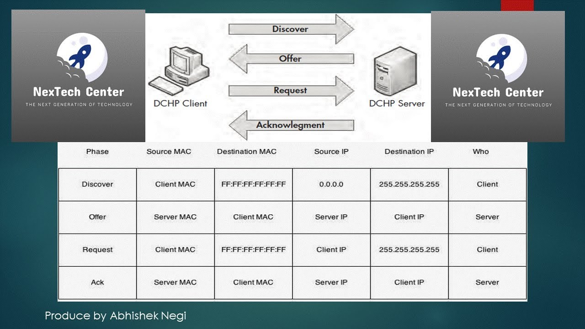
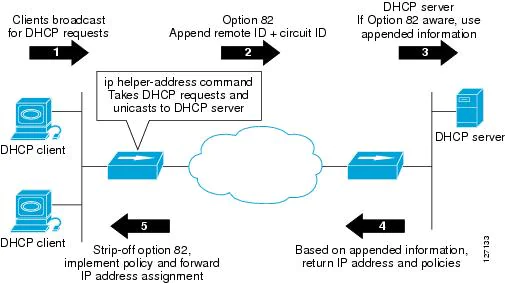
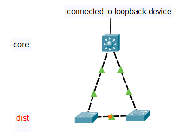

# Multilayer switch

- چرا به جای روتر از مولتی لایر سوییچ استفاده می کنیم؟
	+ دلایل اقتصادی (قیمت حساب شده برای هر پورت)






# router on stick scenario:



- در مواقعی که ۲ تا vlan داریم و می خواهیم به هر نحوی که شده آنها را به هم متصل کنیم می توانیم از این سناریو کمک بگیریم
	
## router on stick with one port using sub-interfaces


	
- در این حالت با استفاده از دو sub-interface در روتر و با استفاده از مشخص کردن encapsulation dot1q برای sub-interface ها، می توانیم فقط با استفاده از یک اینترفیس همان سناریو قبلی را پیاده سازی کنیم
- فقط باید توجه کرد که اینترفیس واسط بر روی مد trunk قرار بگیرد
- `(config-subif)# encap dot1q 10`
- در این سناریو پهنای باند ما بین دو ویلن نصف می شود


---
- جای که ۲ توسط ، لایه ۳ شکسته شود دیگر vlan ها متصل نخواهند بود ، زیرا روتر در حالت عادی هیچ درکی از vlan ها ندارد
	
---


# application of multilayer switch
## scenario 1



- in multi-layer switch:
```
vlan 10
vlan 20
int vlan 10
ip addr 192.168.10.10 255.255.255.0
int vlan 20
ip addr 192.168.10.10 255.255.255.0

int fa 0/0
switchport mode trunk
int fa 0/1
switchport mode trunk

exit
ip routing
```

---
- چند دستور مفید در سوییچ ها:
```
sh int stat
sh vlan br
sh span vlan
sh int switchport
sh int stat err
```
---

- روتر ها نیز می توانند اینترفیس هایشان را لایه ۲ ای به هم متصل کنند بوسیله bridge


# DHCP
- چرا باید آی پی داشته باشیم؟ اگر آی پی نداشته باشیم نمی توانیم حتی arp کنیم

- udp port 67,68
	+ 67 -> server
	+ 68 -> clients
	
- DORA:
	+ Discover
	+ Offer
	+ Request (به من این آی پی را بده)
	+ Ack (DHCP options)

	

	
	
	
- چرا فرایند dhcp با چهار پکت انجام می شود؟
	+ چون ممکن است چند dhcp server در شبکه داشته باشیم
	
	
## cmds
```
ip dhcp pool vlan 10
net 192.168.10.0 255.255.255.0
default-router 192.168.10.1
dns-server 8.8.8.8
domain-name pardp.ir
option 150 ...
exit

ip dhcp excluded-range 192.168.10.1 192.168.10.10

sh ip dhcp binding
clear ip dhcp binding


```
- دی اچ سی پی سرور از کجا می فهمد که باید از کدام pool به کسی آی پی بدهد ؟
	+ به رنج نتورکی که به آن متصل است و پکت می گیرد نگاه می کند
- dhcp options list iana


## dhcp relay agent
- `(config-if)# ip helper-agent 192.168.12.1`




# Extra
- در بسیاری از سناریو ها که نیاز به redundancy بالا داریم دیوایس loopback می تواند خیلی کمک کننده باشد
- برای مثال در این سناریو اگه ip helper را آی پی دیوایس loopback ست کنیم به جای اینکه آی پی سر اینترفیس لایه core را بگذاریم ، آنگاه اگر یکی از مسیر ها قطع شود مسیر دیگری می تواند ما را به loopback برساند (redundancy)


